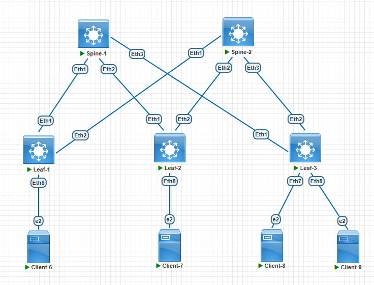

###  Задание:

  1. Соберите топологию CLOS, как на схеме;
  2. Распределите адресное пространство для Underlay сети;
  3. Зафиксируете в документации план работ, адресное пространство, схему сети, настройки (если перенесли на оборудование);

### Решение:

1. Cхема лабораторного стенда, выполненная в PNetLab:

2. Адресное пространство для сети Underlay:
 
 Таблица сетей для организации IP связности между Spine и Leaf коммутаторами.

| Network IPv4     | Summary net    | Description        | Eq&port Spine/Leaf | Assigned IPs Spine/Leaf     |
|-----------------:|:---------------|:------------------:|--------------------|-----------------------------|
| 10.10.1.0/30     | 10.10.0.0/16   | P2P Spine1-Leaf1   | Eth1-Eth1          | 10.10.1.1/10.10.1.2         |
| 10.10.11.0/30    | 10.10.0.0/16   | P2P Spine2-Leaf1   | Eth1-Eth2          | 10.10.11.1/10.10.11.2       |
| 10.10.2.0/30     | 10.10.0.0/16   | P2P Spine1-Leaf2   | Eth2-Eth1          | 10.10.2.1/10.10.2.2         |
| 10.10.12.0/30    | 10.10.0.0/16   | P2P Spine2-Leaf2   | Eth2-Eth2          | 10.10.12.1/10.10.12.2       |
| 10.10.3.0/30     | 10.10.0.0/16   | P2P Spine1-Leaf3   | Eth3-Eth1          | 10.10.3.1/10.10.3.2         |
| 10.10.13.0/30    | 10.10.0.0/16   | P2P Spine2-Leaf3   | Eth3-Eth2          | 10.10.13.1/10.10.13.2       |

Третий октет подразумевает номер Leaf коммутатора. Если видим в третьем октете единицу, то это подключение Leaf1 к Spine1.
Если видим в третьем октете 11, то это подключение Leaf1 к Spine2 и т.д.

Таблица сетей для назначения на Loopback интерфейсы:
| Network IPv4     | Summary net    | Description        | Assigned           |
|-----------------:|:---------------|:------------------:|--------------------|
| 1.1.1.1/32       | 1.1.1.0/24     | Loopback0          | Leaf1              |
| 1.1.1.2/32       | 1.1.1.0/24     | Loopback0          | Leaf2              |
| 1.1.1.3/32       | 1.1.1.0/24     | Loopback0          | Leaf3              |

3. План работ
    1. Смотнтировать устройства
    2. Провести работы по каблированию
    3. Назначить логические имена на устройства, назначить запланированные IP адреса на интерфейсы.